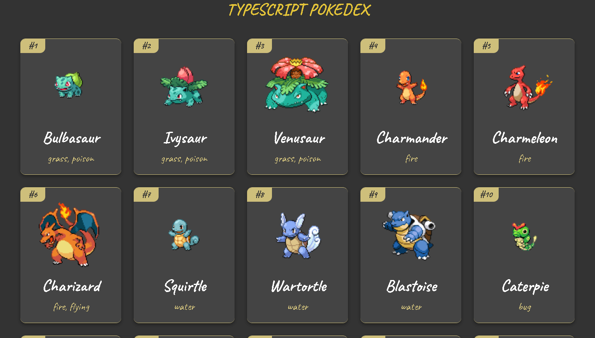

## Introduction

This repository contains some projects made in Typescript for learning and practicing the language. These projects are based on internet tutorials and own ideas.

### Pokedex

This application makes a connection to [PokeAPI](pokeapi.co) and retrieves information about the first 100 pokemons, then, it creates a card view for each one and shows it on screen.

This application uses not any non-vanilla typescript library